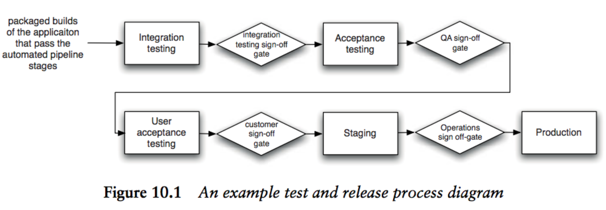
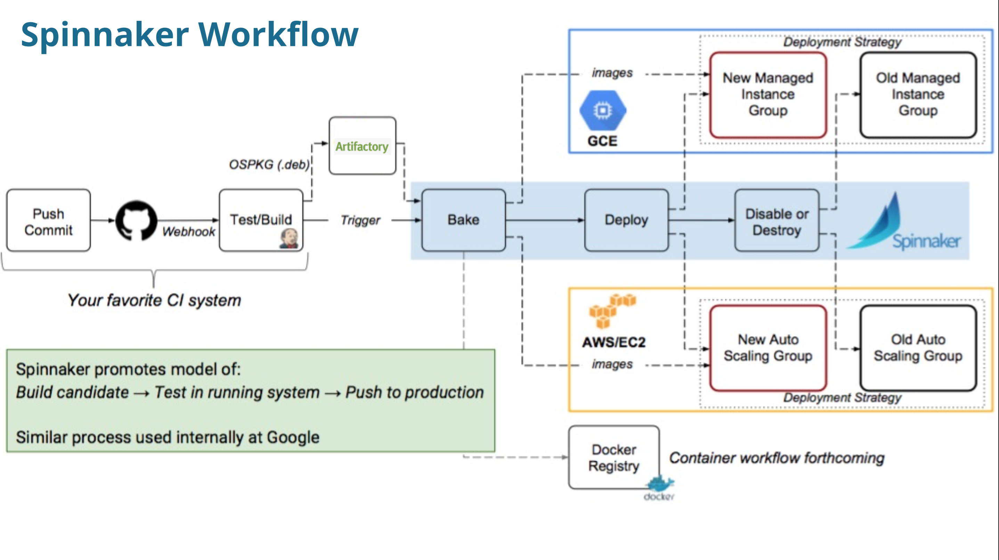
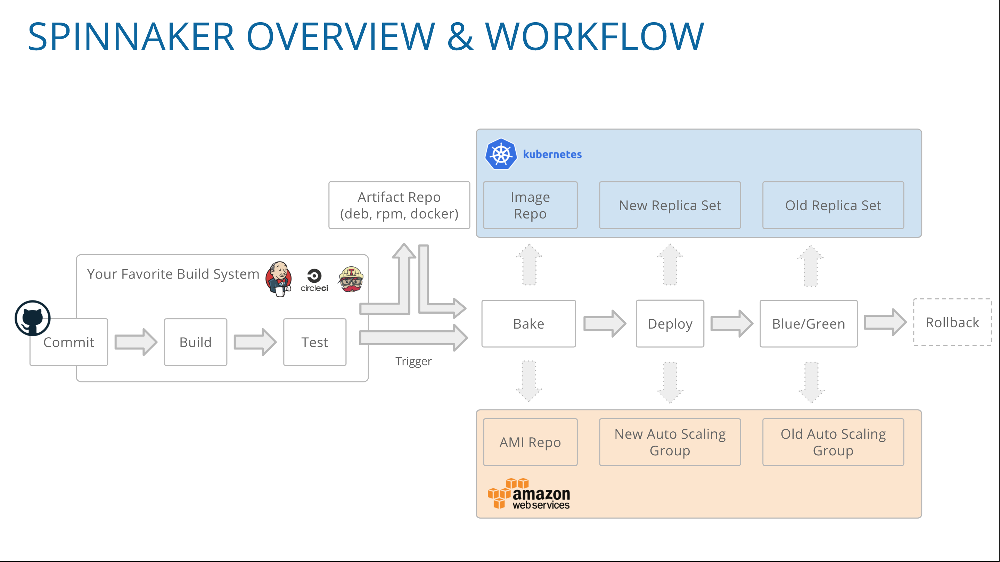

# continuous-delivery-deployment

what is continuous integration? what is continuous delivery? what is continuous deployment? what is release strategy?

## Deployment Pipeline Practices

1. Only Build Your Binaries Once

So, you should only build your binaries once, during the commit stage of the build. These binaries should be stored on a filesystem somewhere (not in version control, since they are derivatives of your baseline, not part of its definition) where it is easy to retrieve them for later stages in the pipeline. 

2. Deploy the Same Way to Every Environment

It is essential to use the same process to deploy to every environment—whether a developer or analyst’s workstation, a testing environment, or production—in order to ensure that the build and deployment process is tested effectively. Developers deploy all the time; testers and analysts, less often; and usually, you will deploy to production fairly infrequently. But this frequency of deployment is the inverse of the risk associated with each environment. The environment you deploy to least frequently (production) is the most important. Only after you have tested the deployment process hundreds of times on many environments can you eliminate the deployment script as a source of error

3. Smoke-Test Your Deployments

When you deploy your application, you should have an automated script that does a smoke test to make sure that it is up and running. This could be as simple as launching the application and checking to make sure that the main screen comes up with the expected content. Your smoke test should also check that any services your application depends on are up and running—such as a database, messaging bus, or external service.

The smoke test, or deployment test, is probably the most important test twrite once you have a unit test suite up and running—indeed, it’s arguably even more important. It gives you the confidence that your application actually runs. If it doesn’t run, your smoke test should be able to give you some basic diagnostics as to whether your application is down because something it depends on is not working.

4. Deploy into a Copy of Production

The other main problem many teams experience going live is that their production environment is significantly different from their testing and development environments. To get a good level of confidence that going live will actually work, you need to do your testing and continuous integration on environments that are as similar as possible to your production environment.

5. Each Change Should Propagate through the Pipeline Instantly

The deployment pipeline takes a different approach: The first stage should be triggered upon every check-in, and each stage should trigger the next one immediately upon successful completion.

6. If Any Part of the Pipeline Fails, Stop the Line

As we said in the “Implementing Continuous Integration” section, the most important step in achieving the goals of this book—rapid, repeatable, reliable releases—is for your team to accept that every time they check code into version control, it will successfully build and pass every test. This applies to the entire deployment pipeline. If a deployment to an environment fails, the whole team owns that failure. They should stop and fix it before doing anything else.

## Creating a Release Strategy

The most important part of creating a release strategy is for the application’s stakeholders to meet up during the project planning process. The point of their discussions should be working out a common understanding concerning the deployment and maintenance of the application throughout its lifecycle. This shared understanding is then captured as the release strategy. This document will be updated and maintained by the stakeholders throughout the application’s life. When creating the first version of your release strategy at the beginning of the project, you should consider including the following:

- An asset and configuration management strategy.
- A description of the technology used for deployment. This should be agreed upon by both the operations and development teams.
- A plan for implementing the deployment pipeline.
- An enumeration of the environments available for acceptance, capacity, integration, and user acceptance testing, and the process by which builds will be moved through these environments.
- A description of the processes to be followed for deployment into testing and production environments, such as change requests to be opened and approvals that need to be granted.
- Requirements for monitoring the application, including any APIs or services the application should use to notify the operations team of its state.
- A discussion of the method by which the application’s deploy-time and runtime configuration will be managed, and how this relates to the automated deployment process.
- Description of the integration with any external systems. At what stage and how are they tested as part of a release? How do the operations personnel communicate with the provider in the event of a problem?
- Details of logging so that operations personnel can determine the application’s state and identify any error conditions.
- A disaster recovery plan so that the application’s state can be recovered following a disaster.
The service-level agreements for the software, which will determine
whether the application will require techniques like failover and other
high-availability strategies.
- Production sizing and capacity planning: How much data will your live application create? How many log files or databases will you need? How much bandwidth and disk space will you need? What latency are clients expecting?
- An archiving strategy so that production data that is no longer needed can be kept for auditing or support purposes.
- How the initial deployment to production works?
- How fixing defects and applying patches to the production environment will be handled?
- How upgrades to the production environment will be handled, including data migration?
- How application support will be managed?

Creating the strategy is of course just the beginning; it will be added to and changed as the project progresses.

A vital component of the release strategy is the release plan describing how releases are performed.

### The Release Plan

The first release is usually the one that carries the highest risk; it needs careful planning. The results of this planning may be automated scripts, documentation, or other procedures needed to reliably and repeatedly deploy the application into the production environment. In addition to the material in the release strategy, it should include: 

- The steps required to deploy the application for the first time
- How to smoke-test the application and any services it uses as part of the deployment process
- The steps required to back out the deployment should it go wrong
- The steps required to back up and restore the application’s state
- The steps required to upgrade the application without destroying theapplication’s state
- The steps to restart or redeploy the application should it fail
- The location of the logs and a description of the information they contain
- The methods of monitoring the application
- The steps to perform any data migrations that are necessary as part of the release
- An issue log of problems from previous deployments, and their solutions

## Deploying and Promoting Your Application

The key to deploying any application in a reliable, consistent manner is constant practice: Use the same process to deploy to every environment, including production.

- Promotion Pipelines

### Modeling Your Release Process and Promoting Builds

In particular, it is important to capture:

- What stages a build has to go through in order to be released (for example, integration testing, QA acceptance testing, user acceptance testing, staging, production)
- What the required gates or approval are
- For each gate, who has the authority to approve a build passing through that gate

At the end of this exercise, you might end up with a diagram similar to this:

Once you’ve created this diagram, you can create placeholders for each part of your release process in the tool you use for managing deployments. Once this is done, it should be possible for the people responsible for approvals to approve, using your tool, a particular build moving through a gate in the release process.

The other essential facility that must be provided by the tool you use to manage your deployment pipeline is the ability, for each stage, to see which builds have passed all the previous stages in the pipeline and are hence ready for the next stage. It should then be possible to choose one of these builds and press a button to have it deployed. This process is known as promotion. Promoting builds at the press of a button is what turns the deployment pipeline into a pull system, giving everybody involved in the delivery process the ability to manage their own work. Analysts and testers can self-service deployments for exploratory testing, showcasing, or usability testing. Operations personnel can deploy any version of their choice to staging or production at the press of a button.

## Emergency Fixes

In every system, there comes a moment when a critical defect is discovered and has to be fixed as soon as possible. In this situation, the most important thing to bear in mind is: Do not, under any circumstances, subvert your process. Emergency fixes have to go through the same build, deploy, test, and release process as any other change. Why do we say this? Because we have seen so many occasions where fixes were made by logging directly into production environments and making uncontrolled changes.

## Continuous Deployment

The idea is simply this: I take my pipeline and make the final step—deployment to production—automatic. That way, if a check-in passes all the automated tests, it gets deployed directly to production. In order for this not to cause breakages, your automated tests have to be fantastic—there should be automated unit tests, component tests, and acceptance tests (functional and nonfunctional) covering your entire application. You have to write all your tests—including acceptance tests—first, so that only when a story is complete will check-ins pass the acceptance tests.

Perhaps most importantly, continuous deployment forces you to do the right thing (as Fitz points out in his blog post). You can’t do it without automating your entire build, deploy, test, and release process. You can’t do it without a comprehensive, reliable set of automated tests. You can’t do it without writing system tests that run against a production-like environment. That’s why, even if you can’t actually release every set of changes that passes all your tests, you should aim to create a process that would let you do so if you choose to.

> So what magic happens in our test suite that allows us to skip having a manual Quality Assurance step in our deploy process? The magic is in the scope, scale and thoroughness. It’s a thousand test files and counting. 4.4 machine hours of automated tests to be exact. Over an hour of these tests are instances of Internet Explorer automatically clicking through use cases and asserting on behaviour, thanks to Selenium. The rest of the time is spent running unit tests that poke at classes and functions and running functional tests that make web requests and assert on results.

## Tools

1. CI - Jenkins
2. CD - Spinnaker

### Spinnaker

#### What is Spinnaker?

Spinnaker is a solution for supporting CD (Continuous Deployment) operations for software engineering teams. Developed originally by Netflix, it enabled teams to deploy software to multiple environments such as AWS, Google Cloud Platform, OpenStack and Kubernetes. 

[How Spinnaker maps resources to Kubernetes](https://blog.spinnaker.io/lifting-the-sail-how-spinnaker-maps-resources-to-kubernetes-57da9c1657ba)

Kubernetes isn’t always enough to give you a fully automated deployment flow from code to production in containers, especially in large companies with complicated deployment pipeline needs. Spinnaker fills this gap by allowing for orchestration of multiple steps through defining sophisticated stages within deployment pipelines and taking a macro-management approach of looking at all of your deployments. Spinnaker enables sophisticated cloud deployment strategies while being customizable for all sorts of workflows.

## Images

## References

- [Continuous Delivery Book](...)
- [Continuous Deployment by Timothy](http://timothyfitz.com/2009/02/08/continuous-deployment/)
- [Continuous Deployment at IMVU: Doing the impossible fifty times a day.](http://timothyfitz.com/2009/02/10/continuous-deployment-at-imvu-doing-the-impossible-fifty-times-a-day/)
